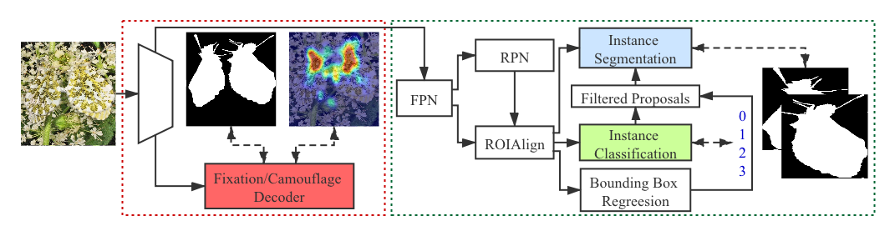
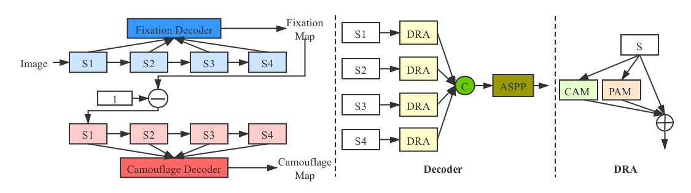

# COD-Rank-Localize-and-Segment (CVPR2021)
Simultaneously Localize, Segment and Rank the Camouflaged Objects



# Full camouflage fixation training dataset is available!

The full camouflage fixation training dataset is available with the full fixation maps for the COD10K training dataset, which can be downloaded from:
https://drive.google.com/file/d/1ofwut8ff92L9LwuWA0U3eEhGG8mwK_nG/view?usp=sharing

# Camouflage Localization and Ranking dataset
We labeled the COD10K training dataset with eye tracker to localize the camouflaged objects, and generate 2000 images with localization and ranking label (We are generating fixation and label for all the existing training and testing dataset, and will release the dataset very soon.). The training dataset is as:

https://drive.google.com/file/d/12kSU6QrPAiumWpSkMqi5nPMo1awBW0_N/view?usp=sharing

which include 2000 images, with the corresponding fixation label, ranking label and instance level labels.

The testing dataset is as:

https://drive.google.com/file/d/1Gz5GzL9eeW13aZjlzaisrJFGO-HmhLxS/view?usp=sharing

which include 280 images with fixation, ranking and instance level labels.

# Our Results

We train our triple-task learning framework with the above 2000 image training dataset and show the results in Table 1 of the main paper. The resulted camouflage maps are as:

https://drive.google.com/file/d/1ahu77JP-hzjgup20fNIftCB_cHanE323/view?usp=sharing

We also train our camouflaged object detection task along with the original COD10K training dataset, and show the performance in Table 4. The resulted camouflage maps are as:

https://drive.google.com/file/d/10sr2lX38FEgSXL3k27gidlaPKo5VQyjv/view?usp=sharing

Note that, we re-train our models, and the resulted performance is slightly difference from our reported numbers.

# Benchmark results:
1) Please download the benchmark results (camoudlage maps) for your convienience. All the benchmark methods are trained with the COD10K training dataset (of size 4040):

https://drive.google.com/drive/folders/1sdly_TFW2WVqSm-hzuVXYKnu3DxkF-0F?usp=sharing

2) Or the computed evaluation metrics:

https://drive.google.com/file/d/17SyikbvnNF6g0_2BteyplQLid2o0KZTc/view?usp=sharing


# New dataset: NC4K
Please download our newly collected camouflaged object detection testing dataset, namely NC4K, in the link below (with image, ground truth map, and instance level annotation):
https://drive.google.com/file/d/1kzpX_U3gbgO9MuwZIWTuRVpiB7V6yrAQ/view?usp=sharing

or please download it from BaiduNetDisk:
链接:https://pan.baidu.com/s/1bG4F2KJ_4UJG_7XG6ZNBHA  密码:d581

# Our Bib:

Please cite our paper if necessary:
```
@inproceedings{yunqiu_cod21,
  title={Simultaneously Localize, Segment and Rank the Camouflaged Objects},
  author={Lyu, Yunqiu and Zhang, Jing and Dai, Yuchao and Li, Aixuan and Liu, Bowen and Barnes, Nick and Fan, Deng-Ping},
  booktitle={Proceedings of the IEEE/CVF Conference on Computer Vision and Pattern Recognition (CVPR)},
  year={2021}
}
```

# Contact

Please drop me an email for further problems or discussion: zjnwpu@gmail.com

